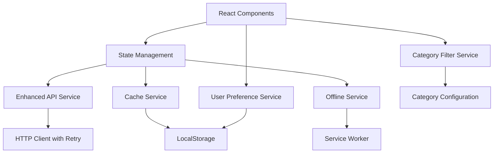

# Design Document

## Overview

This design document outlines the technical approach for improving the Blink PWA application across five key areas: category filtering refactoring, API service enhancement, data consistency, user preferences, and offline capabilities. The improvements will maintain backward compatibility while significantly enhancing maintainability and user experience.

## Architecture

### High-Level Architecture Changes



The architecture introduces several new services while maintaining the existing React component structure. Each service has a single responsibility and can be tested independently.

## Components and Interfaces

### 1. Category Filter Service

**Purpose:** Centralize category filtering logic and make it configuration-driven.

**Interface:**

```typescript
interface CategoryConfig {
  value: Category;
  label: string;
  patterns: string[];
  matchType: "includes" | "exact" | "startsWith";
}

interface CategoryFilterService {
  filterBusinessesByCategory(
    businesses: Business[],
    category: Category
  ): Business[];
  getCategoryConfig(): CategoryConfig[];
  addCategoryConfig(config: CategoryConfig): void;
}
```

**Implementation Strategy:**

- Create a configuration object that maps categories to their matching patterns
- Implement a single filtering function that uses the configuration
- Support multiple matching strategies (includes, exact, startsWith)
- Make the configuration easily extensible

### 2. Enhanced API Service

**Purpose:** Provide robust data fetching with caching, retry logic, and error handling.

**Interface:**

```typescript
interface APIServiceConfig {
  baseURL: string;
  retryAttempts: number;
  retryDelay: number;
  cacheTimeout: number;
}

interface APIService {
  fetchBusinesses(): Promise<Business[]>;
  clearCache(): void;
  getConnectionStatus(): "online" | "offline" | "slow";
}
```

**Implementation Strategy:**

- Implement exponential backoff for retries
- Use localStorage for caching with TTL
- Add request deduplication
- Provide connection status monitoring
- Validate and sanitize API responses

### 3. Cache Service

**Purpose:** Manage application data caching with intelligent cache strategies.

**Interface:**

```typescript
interface CacheEntry<T> {
  data: T;
  timestamp: number;
  version: string;
}

interface CacheService {
  set<T>(key: string, data: T, ttl?: number): void;
  get<T>(key: string): T | null;
  isValid(key: string): boolean;
  clear(pattern?: string): void;
  getSize(): number;
  cleanup(): void;
}
```

**Implementation Strategy:**

- Implement TTL-based cache invalidation
- Add cache size monitoring and cleanup
- Support pattern-based cache clearing
- Version cache entries for data migration

### 4. User Preference Service

**Purpose:** Manage user preferences including favorites and UI customizations.

**Interface:**

```typescript
interface UserPreferences {
  favorites: string[];
  theme: "light" | "dark" | "auto";
  defaultCategory: Category;
  sortPreference: "name" | "rating" | "favorites";
}

interface UserPreferenceService {
  getFavorites(): string[];
  addFavorite(businessId: string): void;
  removeFavorite(businessId: string): void;
  isFavorite(businessId: string): boolean;
  getPreferences(): UserPreferences;
  updatePreferences(preferences: Partial<UserPreferences>): void;
}
```

**Implementation Strategy:**

- Store preferences in localStorage
- Provide reactive updates using custom hooks
- Support preference migration for future versions
- Implement preference validation

### 5. Offline Service

**Purpose:** Handle offline scenarios and provide seamless offline experience.

**Interface:**

```typescript
interface OfflineService {
  isOnline(): boolean;
  onConnectionChange(callback: (online: boolean) => void): () => void;
  queueAction(action: OfflineAction): void;
  processQueue(): Promise<void>;
  getQueueSize(): number;
}

interface OfflineAction {
  type: string;
  payload: any;
  timestamp: number;
  retries: number;
}
```

**Implementation Strategy:**

- Monitor navigator.onLine and network requests
- Queue user actions when offline
- Process queued actions when connection restored
- Provide offline indicators in UI

## Data Models

### Enhanced Business Interface

```typescript
interface Business {
  id: string;
  name: string;
  category: string;
  description: string;
  rating: number;
  location: string;
  image: string;
  benefits: BankBenefit[];
  // New fields
  isFavorite?: boolean;
  lastUpdated?: number;
  imageLoaded?: boolean;
}
```

### Cache Configuration

```typescript
interface CacheConfig {
  businesses: { ttl: 3600000; maxSize: 50 }; // 1 hour, 50 entries
  images: { ttl: 86400000; maxSize: 100 }; // 24 hours, 100 images
  preferences: { ttl: Infinity; maxSize: 1 }; // Never expire
}
```

## Error Handling

### Error Types and Recovery Strategies

1. **Network Errors**
   - Retry with exponential backoff
   - Fall back to cached data
   - Show offline indicator

2. **API Response Errors**
   - Validate response structure
   - Use mock data as fallback
   - Log errors for monitoring

3. **Storage Errors**
   - Handle quota exceeded
   - Implement cache cleanup
   - Graceful degradation

4. **Image Loading Errors**
   - Show placeholder images
   - Retry loading after delay
   - Cache failure status

### Error Boundary Implementation

```typescript
interface ErrorInfo {
  componentStack: string;
  errorBoundary?: string;
}

interface ErrorBoundaryState {
  hasError: boolean;
  error?: Error;
  errorInfo?: ErrorInfo;
}
```

## Testing Strategy

### Unit Testing

- Test each service independently
- Mock external dependencies
- Test error scenarios and edge cases
- Achieve >90% code coverage

### Integration Testing

- Test service interactions
- Test offline/online transitions
- Test cache invalidation scenarios
- Test user preference persistence

### End-to-End Testing

- Test complete user workflows
- Test PWA installation and offline usage
- Test performance under various network conditions
- Test accessibility compliance

### Performance Testing

- Measure cache hit rates
- Monitor bundle size impact
- Test memory usage patterns
- Measure offline loading times

## Migration Strategy

### Phase 1: Infrastructure Setup

- Implement new services without breaking existing functionality
- Add new interfaces and types
- Set up testing infrastructure

### Phase 2: Gradual Integration

- Replace category filtering logic
- Integrate enhanced API service
- Add caching layer

### Phase 3: Feature Enhancement

- Implement user preferences
- Add offline capabilities
- Enhance error handling

### Phase 4: Optimization

- Performance tuning
- Cache optimization
- Bundle size optimization

## Security Considerations

- Validate all user inputs before storage
- Sanitize data from external APIs
- Implement CSP headers for PWA
- Secure localStorage data (no sensitive information)
- Validate cache data integrity
