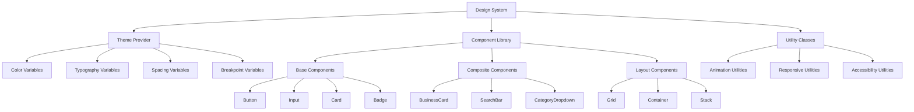

# Design Document

## Overview

This design document outlines a comprehensive UI/UX improvement strategy for the Blink PWA application. The improvements focus on creating a modern, accessible, and user-friendly interface that enhances visual clarity, improves information organization, and provides an intuitive user experience across all device types. The design maintains the existing React component architecture while introducing a cohesive design system and enhanced user interaction patterns.

## Architecture

### Design System Architecture



The architecture introduces a systematic approach to design consistency while maintaining the existing component structure. Each component will be enhanced with improved styling, accessibility features, and responsive behavior.

## Components and Interfaces

### 1. Enhanced Design System

**Purpose:** Establish consistent visual language and reusable design tokens across the application.

**Design Tokens:**

```typescript
interface DesignTokens {
  colors: {
    primary: {
      50: string;
      100: string;
      500: string;
      600: string;
      700: string;
      900: string;
    };
    semantic: {
      success: string;
      warning: string;
      error: string;
      info: string;
    };
    neutral: {
      white: string;
      gray50: string;
      gray100: string;
      gray600: string;
      gray900: string;
    };
  };
  typography: {
    fontFamily: {
      sans: string[];
      display: string[];
    };
    fontSize: {
      xs: string;
      sm: string;
      base: string;
      lg: string;
      xl: string;
      "2xl": string;
      "3xl": string;
      "4xl": string;
    };
    fontWeight: {
      normal: number;
      medium: number;
      semibold: number;
      bold: number;
    };
    lineHeight: {
      tight: number;
      normal: number;
      relaxed: number;
    };
  };
  spacing: {
    xs: string;
    sm: string;
    md: string;
    lg: string;
    xl: string;
    "2xl": string;
    "3xl": string;
  };
  borderRadius: {
    sm: string;
    md: string;
    lg: string;
    xl: string;
    "2xl": string;
    full: string;
  };
  shadows: {
    sm: string;
    md: string;
    lg: string;
    xl: string;
  };
}
```

**Implementation Strategy:**

- Create CSS custom properties for all design tokens
- Use Tailwind CSS configuration to extend with custom tokens
- Implement dark mode support through CSS variables
- Create utility classes for common patterns

### 2. Enhanced BusinessCard Component

**Purpose:** Improve visual hierarchy, information organization, and interaction patterns for business listings.

**Key Improvements:**

- **Better Visual Hierarchy:** Clear separation between business info and benefits
- **Improved Information Layout:** Consistent placement of ratings, location, and actions
- **Enhanced Interaction States:** Better hover, focus, and loading states
- **Accessibility Enhancements:** Proper ARIA labels and keyboard navigation
- **Mobile Optimization:** Touch-friendly targets and responsive layout

**New Interface:**

```typescript
interface EnhancedBusinessCardProps {
  business: Business;
  onBenefitClick?: (benefitIndex: number) => void;
  onFavoriteToggle?: (businessId: string) => void;
  isFavorite?: boolean;
  isLoading?: boolean;
  variant?: "default" | "compact" | "featured";
}
```

**Design Specifications:**

- **Card Structure:** Header image with overlay, content section with clear hierarchy
- **Typography:** Title (text-xl, font-bold), subtitle (text-sm, font-medium), body (text-sm)
- **Spacing:** Consistent 16px padding, 12px gaps between elements
- **Interactive Elements:** 44px minimum touch targets, clear focus indicators
- **Loading States:** Skeleton placeholders for images and content

### 3. Improved Navigation and Layout

**Purpose:** Create intuitive navigation patterns and responsive layout system.

**Enhanced Header Component:**

```typescript
interface EnhancedHeaderProps {
  showBackButton?: boolean;
  title?: string;
  actions?: React.ReactNode;
  variant?: "home" | "detail" | "minimal";
}
```

**Navigation Improvements:**

- **Breadcrumb Navigation:** Clear indication of current location
- **Mobile Navigation:** Hamburger menu for additional options
- **Search Enhancement:** Persistent search with recent searches
- **Filter Indicators:** Visual badges showing active filters

### 4. Enhanced Loading and Empty States

**Purpose:** Provide clear feedback during loading and empty content scenarios.

**Loading State Components:**

```typescript
interface LoadingStateProps {
  type: "skeleton" | "spinner" | "shimmer";
  count?: number;
  height?: string;
  className?: string;
}

interface EmptyStateProps {
  icon: React.ReactNode;
  title: string;
  description: string;
  action?: {
    label: string;
    onClick: () => void;
  };
}
```

**Implementation Strategy:**

- **Skeleton Loading:** Content-aware placeholders that match final layout
- **Progressive Loading:** Show cached content while fetching fresh data
- **Error Recovery:** Clear error messages with retry actions
- **Empty States:** Contextual illustrations and helpful actions

### 5. Accessibility Enhancements

**Purpose:** Ensure full accessibility compliance and inclusive design.

**Accessibility Features:**

- **Keyboard Navigation:** Full keyboard support with visible focus indicators
- **Screen Reader Support:** Proper ARIA labels, roles, and descriptions
- **Color Contrast:** WCAG AA compliant color combinations
- **Motion Preferences:** Respect user's motion preferences
- **Text Scaling:** Support for 200% text scaling without horizontal scrolling

**Implementation Strategy:**

```typescript
interface AccessibilityProps {
  "aria-label"?: string;
  "aria-describedby"?: string;
  "aria-expanded"?: boolean;
  role?: string;
  tabIndex?: number;
}
```

## Data Models

### Enhanced UI State Management

```typescript
interface UIState {
  theme: "light" | "dark" | "auto";
  reducedMotion: boolean;
  highContrast: boolean;
  fontSize: "small" | "medium" | "large";
  layout: "grid" | "list";
  density: "comfortable" | "compact";
}

interface LoadingState {
  isLoading: boolean;
  loadingType: "initial" | "refresh" | "more";
  progress?: number;
}

interface ErrorState {
  hasError: boolean;
  errorType: "network" | "validation" | "unknown";
  message: string;
  canRetry: boolean;
}
```

### Component State Interfaces

```typescript
interface BusinessCardState {
  isExpanded: boolean;
  isImageLoaded: boolean;
  isFavorite: boolean;
  isHovered: boolean;
}

interface SearchState {
  query: string;
  suggestions: string[];
  recentSearches: string[];
  isActive: boolean;
}
```

## Visual Design Specifications

### Color System

**Primary Palette:**

- Primary Blue: #3B82F6 (blue-500)
- Primary Blue Dark: #1D4ED8 (blue-700)
- Primary Blue Light: #DBEAFE (blue-100)

**Semantic Colors:**

- Success: #10B981 (emerald-500)
- Warning: #F59E0B (amber-500)
- Error: #EF4444 (red-500)
- Info: #06B6D4 (cyan-500)

**Neutral Palette:**

- White: #FFFFFF
- Gray 50: #F9FAFB
- Gray 100: #F3F4F6
- Gray 600: #4B5563
- Gray 900: #111827

### Typography Scale

**Font Family:**

- Primary: Inter, system-ui, sans-serif
- Display: Inter, system-ui, sans-serif

**Font Sizes:**

- xs: 12px / 16px line-height
- sm: 14px / 20px line-height
- base: 16px / 24px line-height
- lg: 18px / 28px line-height
- xl: 20px / 28px line-height
- 2xl: 24px / 32px line-height
- 3xl: 30px / 36px line-height
- 4xl: 36px / 40px line-height

### Spacing System

**Base Unit:** 4px

- xs: 4px
- sm: 8px
- md: 16px
- lg: 24px
- xl: 32px
- 2xl: 48px
- 3xl: 64px

### Component Specifications

#### BusinessCard Enhanced Design

**Dimensions:**

- Width: 100% (responsive)
- Min-height: 320px
- Border-radius: 16px
- Shadow: 0 4px 6px -1px rgba(0, 0, 0, 0.1)

**Layout Structure:**

1. **Image Section (192px height)**

   - Gradient overlay: linear-gradient(to top, rgba(0,0,0,0.3), transparent)
   - Business name: text-xl, font-bold, text-white
   - Rating and location: text-sm, text-white/90

2. **Content Section (padding: 24px)**
   - Benefits section with clear visual separation
   - Consistent spacing between elements
   - Action buttons with proper touch targets

#### Enhanced Search Bar

**Dimensions:**

- Height: 56px
- Border-radius: 16px
- Icon size: 20px
- Padding: 16px 16px 16px 48px

**States:**

- Default: border-gray-200, bg-white/90
- Focus: border-blue-500, ring-2 ring-blue-500/20
- Error: border-red-500, ring-2 ring-red-500/20

## Responsive Design Strategy

### Breakpoint System

```css
/* Mobile First Approach */
/* xs: 0px - 475px */
/* sm: 476px - 639px */
/* md: 640px - 767px */
/* lg: 768px - 1023px */
/* xl: 1024px - 1279px */
/* 2xl: 1280px+ */
```

### Layout Adaptations

**Mobile (xs-sm):**

- Single column layout
- Full-width components
- Larger touch targets (44px minimum)
- Simplified navigation

**Tablet (md-lg):**

- Two-column grid for business cards
- Sidebar navigation option
- Optimized for both portrait and landscape

**Desktop (xl-2xl):**

- Three-column grid for business cards
- Enhanced hover states
- Keyboard navigation shortcuts
- Larger content areas

## Animation and Interaction Design

### Animation Principles

**Performance-First:**

- Use CSS transforms and opacity for animations
- Leverage GPU acceleration with transform3d
- Respect user's motion preferences

**Timing Functions:**

- Ease-out for entrances: cubic-bezier(0.0, 0.0, 0.2, 1)
- Ease-in for exits: cubic-bezier(0.4, 0.0, 1, 1)
- Ease-in-out for transitions: cubic-bezier(0.4, 0.0, 0.2, 1)

**Duration Guidelines:**

- Micro-interactions: 150ms
- Component transitions: 250ms
- Page transitions: 300ms
- Complex animations: 500ms max

### Interaction States

**Button States:**

- Default: base styling
- Hover: slight scale (1.02) and shadow increase
- Active: scale (0.98) and shadow decrease
- Focus: ring outline for accessibility
- Disabled: reduced opacity (0.5) and no interactions

**Card Interactions:**

- Hover: shadow elevation and slight scale (1.01)
- Focus: ring outline for keyboard navigation
- Loading: skeleton animation or shimmer effect

## Testing Strategy

### Visual Regression Testing

- Screenshot testing for component variations
- Cross-browser compatibility testing
- Responsive design validation
- Dark mode appearance testing

### Accessibility Testing

- Automated accessibility scanning (axe-core)
- Keyboard navigation testing
- Screen reader compatibility testing
- Color contrast validation
- Focus management testing

### Performance Testing

- Animation performance profiling
- Bundle size impact analysis
- Loading time measurements
- Memory usage monitoring

### User Experience Testing

- Usability testing with real users
- A/B testing for design variations
- Mobile device testing
- Touch interaction validation

## Implementation Phases

### Phase 1: Design System Foundation (Week 1)

- Implement design tokens and CSS variables
- Create base component library
- Set up Tailwind configuration
- Establish accessibility utilities

### Phase 2: Core Component Enhancement (Week 2)

- Enhance BusinessCard component
- Improve SearchBar and CategoryDropdown
- Implement loading and empty states
- Add responsive layout system

### Phase 3: Navigation and Flow Improvements (Week 3)

- Enhance Header component
- Implement breadcrumb navigation
- Add mobile navigation patterns
- Improve page transitions

### Phase 4: Accessibility and Polish (Week 4)

- Complete accessibility implementation
- Add animation and micro-interactions
- Implement dark mode support
- Performance optimization

## Migration Strategy

### Backward Compatibility

- Maintain existing component APIs
- Gradual enhancement approach
- Feature flags for new UI elements
- Fallback support for older browsers

### Progressive Enhancement

- Start with semantic HTML structure
- Layer on CSS enhancements
- Add JavaScript interactions
- Implement advanced features

### Testing and Validation

- Component-by-component testing
- User acceptance testing
- Performance benchmarking
- Accessibility audit

## Security and Performance Considerations

### Performance Optimizations

- Lazy loading for images and components
- CSS-in-JS optimization for dynamic styles
- Bundle splitting for design system
- Efficient animation implementations

### Security Measures

- Content Security Policy for styles
- Sanitization of user-generated content
- Safe handling of external images
- Secure storage of user preferences

### Browser Support

- Modern browsers (Chrome 90+, Firefox 88+, Safari 14+)
- Progressive enhancement for older browsers
- Polyfills for critical features only
- Graceful degradation strategies
